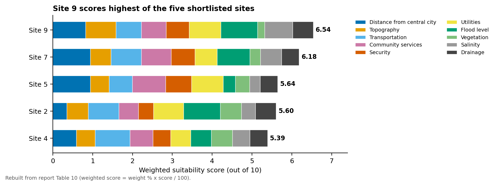
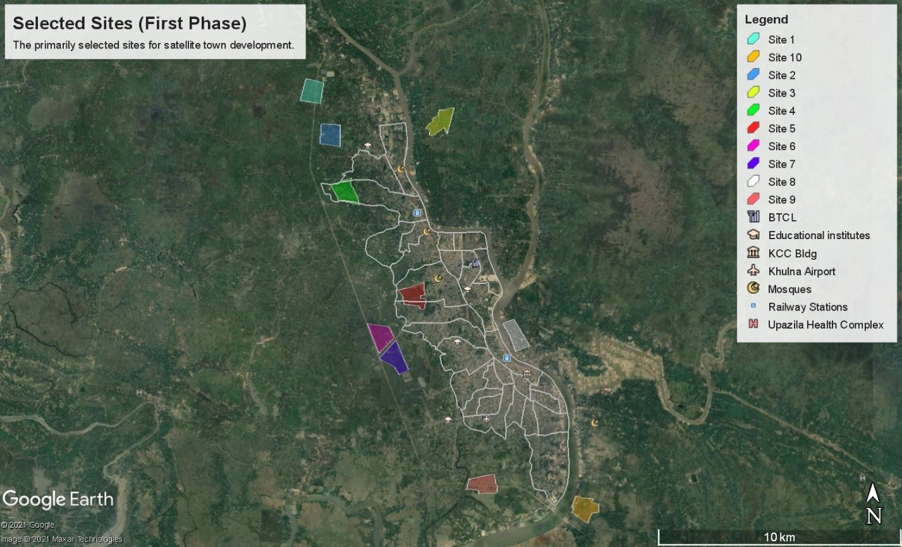
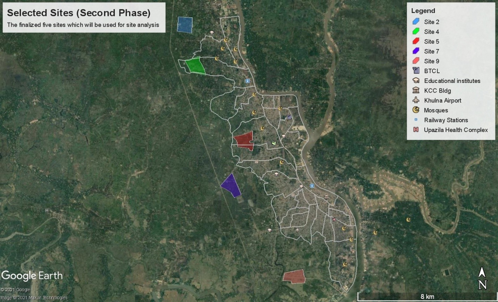
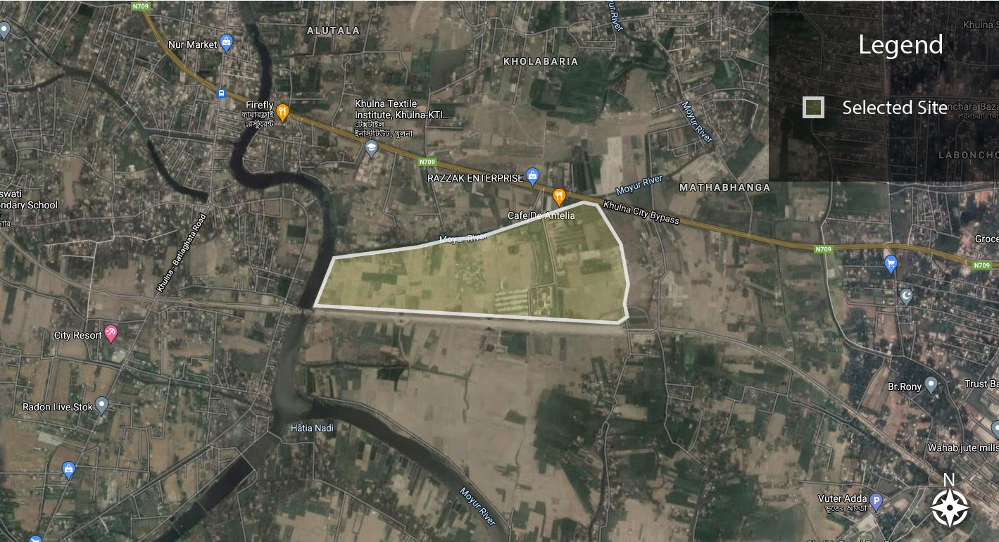
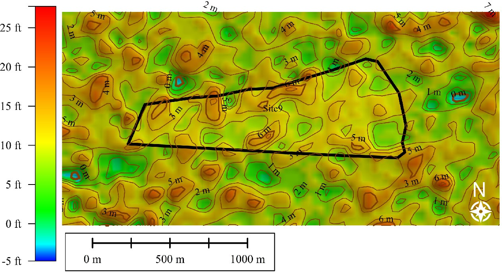
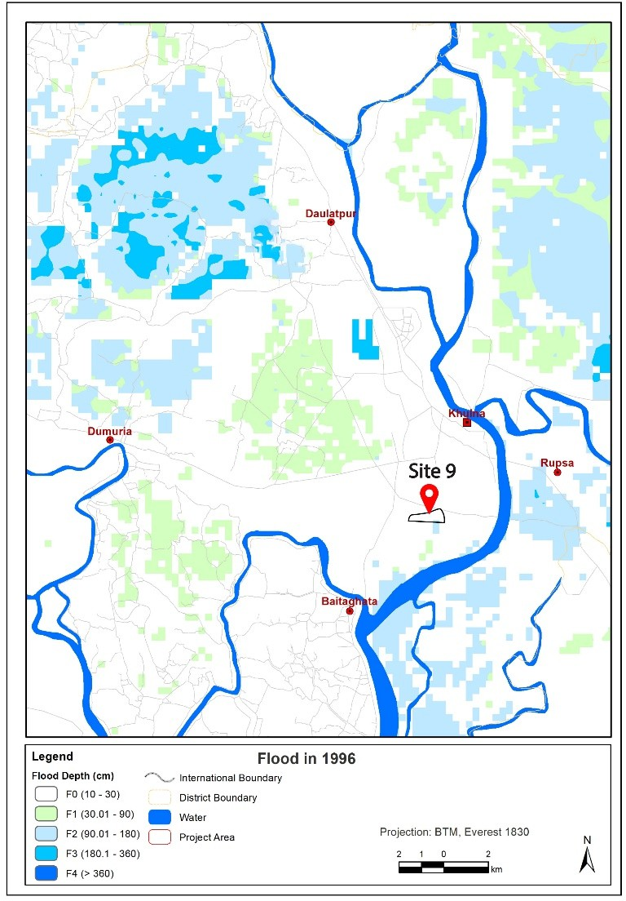
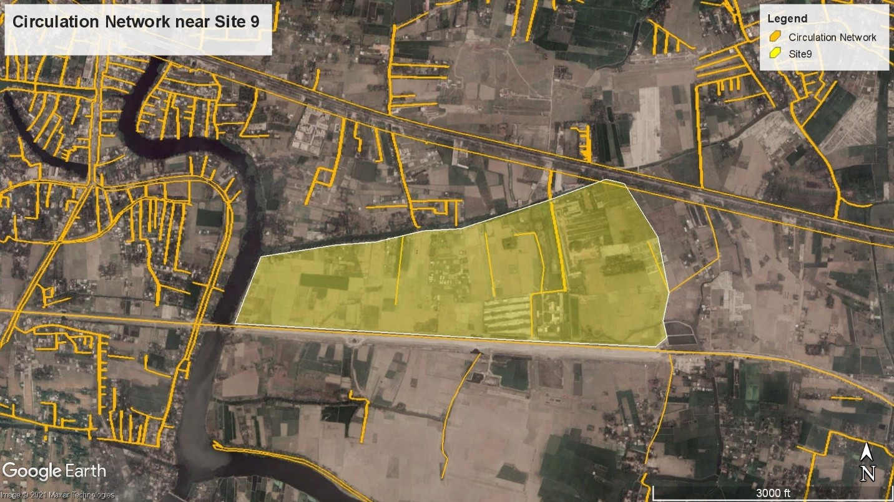
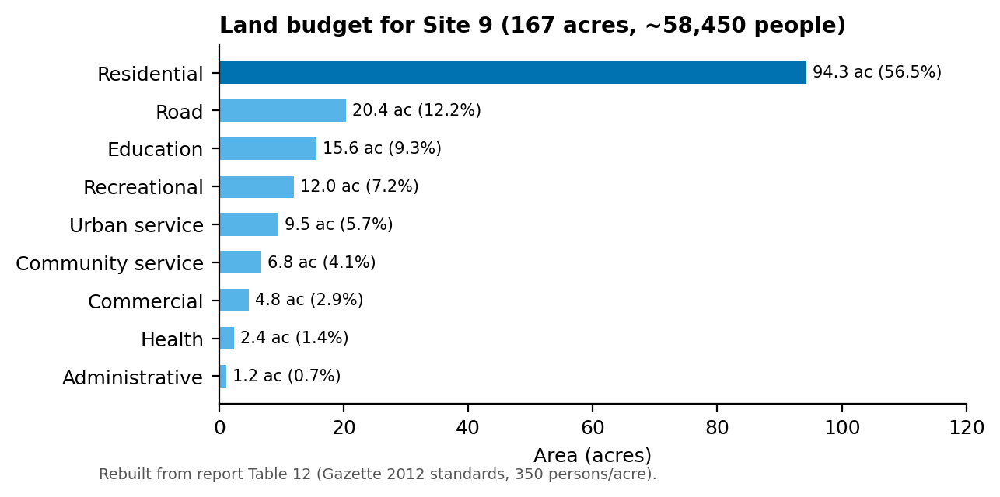

# Suitability Analysis of Satellite Town Sites within the KDA Planning Area, Khulna

**URP 2212 Site and Area Planning Studio, Dept. of Urban and Regional Planning, KUET** · 
## Summary

Khulna's population is growing, and the Padma Bridge is expected to bring more industrial growth, so the city will need planned places to house future residents. We screened 10 candidate sites for a satellite town (150–200 acres, within 20 km of the Khulna City Corporation (KCC) boundary, excluding water bodies and forest). We shortlisted 5 and ranked them with a weighted multi-factor analysis of 18 sub-factors. **Site 9**, on the Moyur River beside the Khulna City Bypass, scored highest (6.54 out of 10). We then analysed that site in detail and prepared a land budget for about 58,450 residents.



## Study area

The Khulna Development Authority (KDA) planning area around Khulna City Corporation, south-west Bangladesh.

| 10 candidate sites | 5 shortlisted sites |
|---|---|
|  |  |

## Data

| Data | Source |
|---|---|
| KDA and KCC boundaries (KML), base and environmental maps | Provided by the course teachers |
| Distances to roads, rail, schools, markets, hospitals, police, fire service, fuel and power stations | Measured in Google Earth Pro and Google Maps |
| Flood depth, elevation, vegetation, water bodies | Map overlays in Google Earth Pro |
| Salinity | Morshed, Sarkar, Zaman & Islam (2020), salinity-based coastal land-use zoning |
| Climate (temperature, humidity, rainfall, wind) | weather-atlas.com, meteoblue.com |

Fieldwork was not possible during COVID-19, so all site data were collected remotely.

## Method

1. Set site conditions and chose 10 determinant factors: distance from the city centre, topography, transportation, community services, security, utilities, flood level, vegetation, salinity and drainage.
2. Identified 10 candidate sites, then shortlisted 5 in group discussion.
3. Measured each sub-factor and rescaled it to a 0–10 score by linear interpolation between the best and worst site.
4. Weighted the factors using averaged expert scores (for example, distance from the city centre 11.76% and flood level 10.29%). Each factor weight was split among its sub-factors.
5. Calculated weighted totals, then ranked the sites.
6. Analysed Site 9 in detail (climate, soil, salinity, elevation, flood, roads, neighbourhoods, security, SWOT), estimated the fill volume and calculated facility areas from the 2012 Gazette standards.

## Results

- **Ranking:** Site 9 (**6.54**) > Site 7 (6.18) > Site 5 (5.64) > Site 2 (5.60) > Site 4 (5.39).
- Site 9 scored well on flood level, salinity, elevation, police access and power supply, but poorly on vegetation, railway access and fire-service distance.
- **Site 9 plan:** 167 acres after boundary fixing. At 350 persons/acre it can house 58,450 people (rounded to 60,000 in the report). The land budget gives **94.3 acres (56.5%)** to housing, 20.4 acres to roads, and the rest to education, recreation, health, commercial and urban services.



| Elevation | Flood map | Road network |
|---|---|---|
|  |  |  |



A preview of the project poster is at [`images/poster-preview.jpg`](images/poster-preview.jpg).

## Tools

Google Earth Pro, Google Maps, Microsoft Excel (scoring and weighting), Python/matplotlib (redrawn charts in [`viz/`](viz/))

## Repository contents

```
images/   original maps (unchanged), poster preview, redrawn charts
viz/      make_figures.py and data/*.csv (Tables 10 and 12 from the report)
```

## Contact

Chinmoy Ghosh Shuvo · Open to collaboration and knowledge sharing. Feel free to reach out on [LinkedIn](https://www.linkedin.com/in/chinmoyghosh034).
